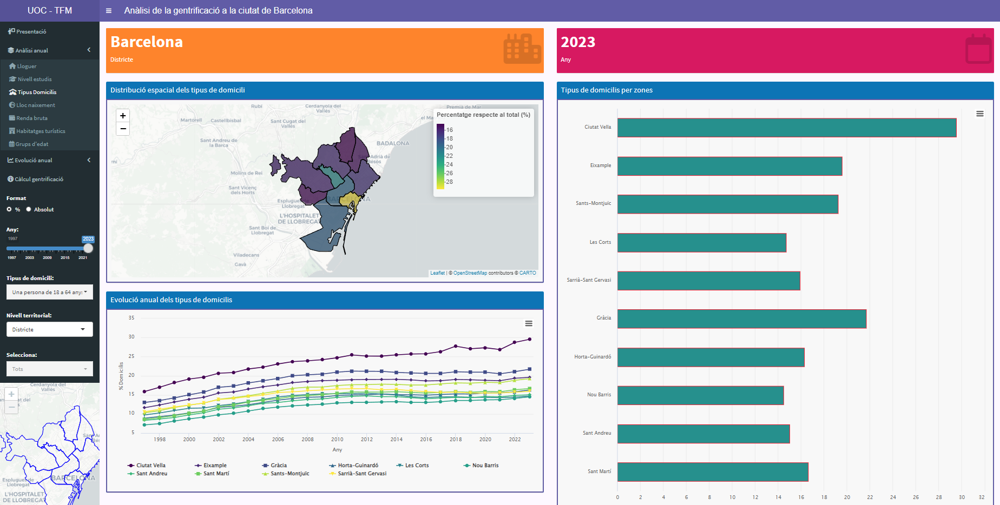
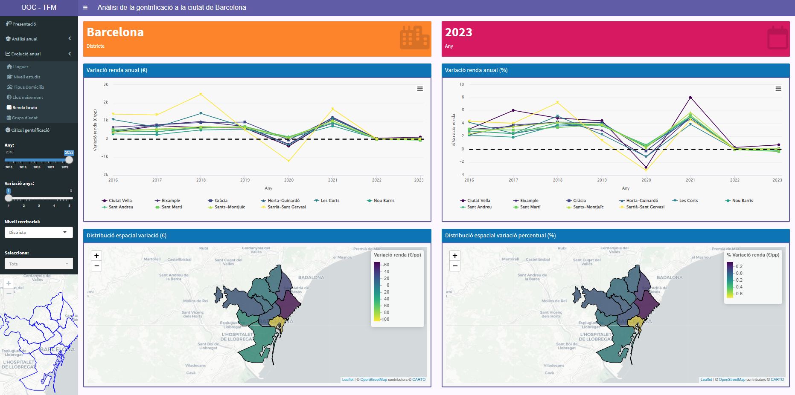
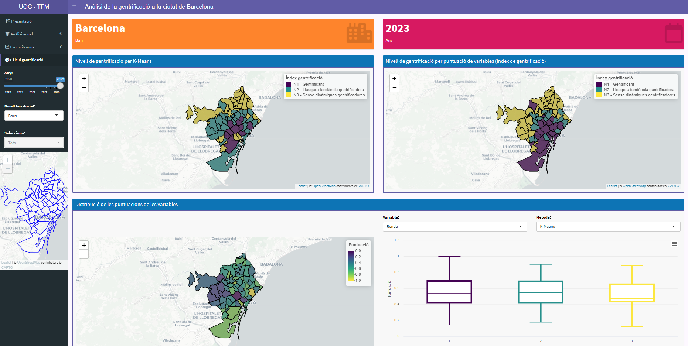

Evolució de la gentrificació a la ciutat de Barcelona i anàlisi dels
factors que la caracteritzen
================
Albert Salvador Yuste
(març - maig 2024)

# Visualització interactiva

Repositori amb tot el programari utilitzat per a la creació d’una
visualització interactiva de les dades utilitzades durant el projecte de
Treball Final de Màster, així com els resultats finals obtinguts. Aquest
visualitzador ha permès realitzar un anàlisi visual de les dades
utilitzades, així com la representació final dels nivells de
gentrificació calculats per al diferents barris de Barcelona al llarg
d’un període d’estudi.

El visualitzador final està disponible al portal
[shinyapps.io](https://www.shinyapps.io) a través del següent
[enllaç](https://asyuste.shinyapps.io/uoc_tfm_shiny/).

El programari utilitzat per al tractament de les dades d’aquesta
visualització es pot trobar al següent repositori de Github a través del
següent [enllaç](https://github.com/ASYuste/TFM_UOC_Gentrificacio).

## Contingut del repositori

La visualització interactiva s’ha creat plenament amb el llenguatge de
programació R, aprofitant les bondats de les llibreries *Shiny* i
*ShinyDashboard* per a la seva concepció, i les llibreries *Highcharter*
i *Leaflet* que han permès la creació de gràfics i mapes amb una alta
interactivitat i possibilitat d’extreure resultats.

Aquesta visualització està separada en tres arxius clau:

- **[global.R](https://github.com/ASYuste/TFM_UOC_Gentrificacio_Visualitzador/blob/main/global.R)**:
  En aquest arxiu es carreguen totes les llibreries necessàries i els
  conjunts de dades continguts al directori `data` i es prepara la
  informació de manera preliminar per a que es pugui realitzar una
  consulta ràpida a través del visualitzador.
- **[ui.R](https://github.com/ASYuste/TFM_UOC_Gentrificacio_Visualitzador/blob/main/ui.R)**:
  Part encarregada de gestionar la capa de presentació (*frontend*) de
  la visualització, on es creen les diferents pestanyes i es gestiona la
  distribució general de la pàgina, tant a nivell de selectors com dels
  diferents gràfics que s’hi representen, entre d’altres.
- **[server.R](https://github.com/ASYuste/TFM_UOC_Gentrificacio_Visualitzador/blob/main/server.R)**:
  Part encarregada de la capa d’accés a les dades (*backend*) juntament
  amb l’arxiu `ui.R`, però més enfocat a la utilització d’aquestes per
  la creació de noves variables dinàmiques que permetin adaptar-se als
  diferents selectors de la pàgina i retorna les representacions
  gràfiques sol·licitades.

## Parts del visualitzador

- **Anàlisi anual:** La primera de les pestanyes conté informació anual
  d’un seguit de variables que s’han considerat influents a l’hora de
  determinar els processos de gentrificació. Per a cada variable
  apareixen a la columna esquerra un seguit de selectors i filtres per
  tal de consultar els valors dels diferents anys, consulta de conjunts
  de població concrets, granularitat segons si es consulten valors de
  barri / districte / ciutat, etc.

- **Evolució anual:** Es segueixen observant la majoria de les variables
  de l’anterior pestanya, però tenint en compte la seva variació
  respecte a alguns anys enrere. Igual que en l’anterior cas, es pot
  modificar de quin any vol realitzar la consulta i respecte a quants
  anys enrere es vol comparar. El rang de dates màxim de consulta en
  aquesta pestanya està entre l’any 2016 i 2023, i la diferència d’anys
  a comparar és entre 1 i 5 anys de diferència.

- **Càlcul gentrificació:** La última de les parts presenta les
  representacions gràfiques dels resultats dels nivells de gentrificació
  seguint dues metodologies diferents. A diferència dels casos
  anteriors, la precisió dels càlculs es limita a valors de barris, i el
  valor d’anys de comparació entre variables amb el pas del temps que
  s’ha establer per al seu càlcul està fixat a 5 anys, per lo que els
  rangs de data de consulta està limitat entre els anys 2020 i 2023.
  També es pot observar la distribució de les puntuacions de les
  diferents variables per barris i els valors que s’obtenen segons el
  mètode aplicat. Finalment es pot observar en forma de taula els valors
  obtinguts.

